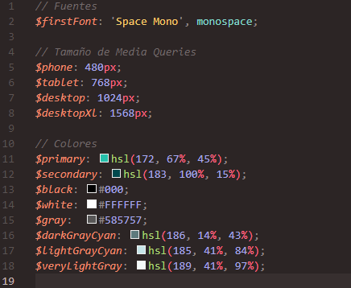

# Frontend Mentor - Tip calculator app

## Challenge done with HTML, SASS and JS

You can check all the files and diferent changes that has been made overtime, Every feedback is welcome!

## Edit styles for own use:

You can edit SASS styles directly on src/scss/base/_variables.scss

## ¿Where to find this challenge?

You can find this challenge here: https://www.frontendmentor.io/challenges/tip-calculator-app-ugJNGbJUX/hub/tip-calculator-app-H1N1QDFI9

